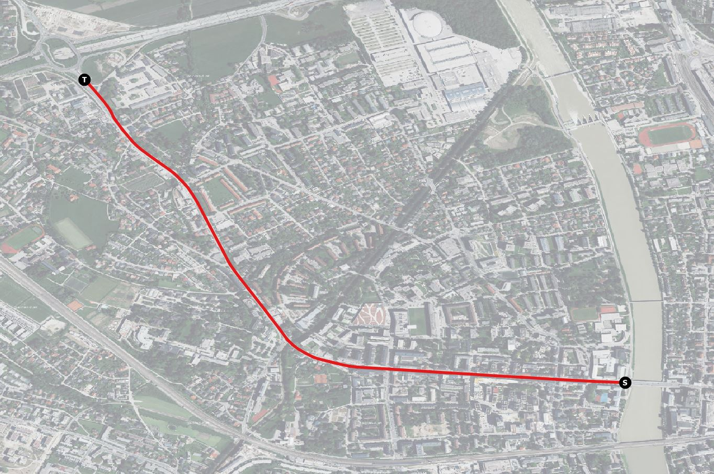
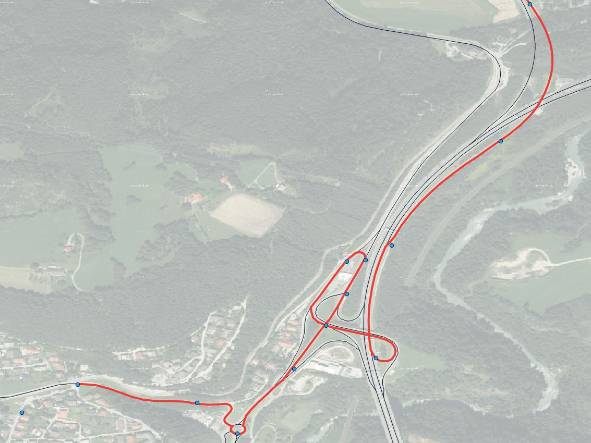
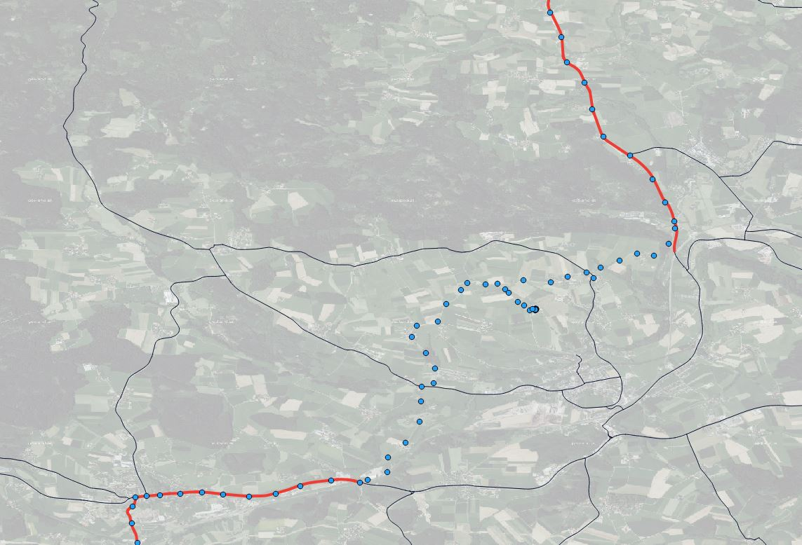

<p align="right">

</p>

# Graphium Neo4j

Graphium Neo4j is an extension of the project [Graphium](https://github.com/graphium-project/graphium) implemented as Neo4j Server plugin.

Graphium Neo4j is an extension of the project Graphium based on Neo4j. Neo4j is a famous graph database which comes with various graph algorithms. Neo4j's graph model is built for answering graph dependent questions in a more flexible and performant way than you can do with a relational database. As transport graphs can be modeled as graphs and stored in Neo4j, we benefit from its features.

Graphium Neo4j is built for those who want to manage graphs and graph versions within Neo4j and / or need routing or even a map matching API. Graphium Neo4j consists of modules which have to be deployed as Neo4j Server plugins (so called unmanaged extensions). Therefore Graphium Neo4j is not a standalone server but requires a Neo4j Server.

## Features

### Graphium Core

Graphium Neo4j include all Graphium core features. See [Graphium](https://github.com/graphium-project/graphium).

### Routing

Graphium Neo4j's routing API handles routing requests between two coordinates on a transport graph. The result will be returned in a JSON format.

<p align="center">

<br/>
<a href="https://www.basemap.at/">Map: basemap.at</a>
</p>

### Map Matching

Graphium Neo4j's map matching API matches trajectories onto a transport graph. In contrast to Hidden Markov Model implementations, Graphium Neo4j's map matching core implementation is built for processing trajectories having a high sampling rate (<20 seconds). The main focus was to enable a high-performance processing of those high-sampled trajectories with a very low error ratio. Also low-sampled trajectories can be processed, but with an increasing error ratio. With Graphium's ability of working in distributed systems, you can improve the performance by horizontal scaling. Graphium Neo4j's map matching supports offline and online map matching.

Map Matching of a lower sampled track (for better visualization); blue point show GPS track points, red linestring represents the map matched path on graph (thin black linestrings):

<p align="center">

<br/>
<a href="https://www.basemap.at/">Map: basemap.at</a>
</p>


Map Matching of a track whose GPS track points partially could not have been matched onto graph. The map matcher detects non matchable parts of the track and splits the map matched path:

<p align="center">

<br/>
<a href="https://www.basemap.at/">Map: basemap.at</a>
</p>

### Please note

For both routing and map matching a valid graph version (especially validity has to be defined correctly) has to be imported and activated (state is ACTIVE). If a graph version has been imported its state is INITIAL, which normally means someone has to verify the data first or this graph version is only some kind of test version and should not be taken into account for the production system. Only after verification and activation of a graph version it can be used for processing.

## API

### Routing

- [GET route](docs/api/get_route.md)
- [GET route on graph version](docs/api/get_routeOnGraphVersion.md)
- [GET route segments](docs/api/get_routeSegments.md)
- [GET route segments on graph version](docs/api/get_routeSegmentsOnGraphVersion.md)

### Map Matching

- [POST match track](docs/api/post_matchTrack.md)
- [POST match track on current graph version](docs/api/post_matchTrackOnCurrentGraphVersion.md)

## Quickstart

### Build and Deployment

1. Graphium Neo4j is an extension of Graphium. Therefore [Graphium](https://github.com/graphium-project/graphium) has to be checked out and built before. 

2. Build Graphium Neo4j via Maven
   `mvn clean install`

3. The following plugins have to be deployed in the Neo4j's *plugins* directory:
   `graphium-neo4j-server-integration-plugin-XXX.jar` (Graphium's core functionality and integration into Neo4j)
   `graphium-api-neo4j-plugin-XXX.jar` (API)
   `graphium-routing-neo4j-plugin-XXX.jar` (routing functionality and API)
   `graphium-mapmatching-neo4j-plugin-XXX.jar` (map matching functionality and API)

4. Copy property files to Neo4j's *conf* directory and configure:

   ```
   graphVersionCapacities.properties
   import.properties
   log4j.xml
   mapmatcher.properties
   neo4j_db.properties
   server.properties
   ```

   Default property files can be found in [neo4j-server-integration/doc/neo4j-default/conf](neo4j-server-integration/doc/neo4j-default/conf).

   The following properties within server.properties have to be adapted. Be careful at changing other property values:
   *graphium.server.name*
   *graphium.server.uri*

5. Register Graphium at Neo4j: *neo4j.conf* in Neo4j's *conf* directory has to be extended by:

   ```
   dbms.unmanaged_extension_classes=at.srfg.graphium.neo4j.bootstrap=/graphium-neo4j/api
   dbms.jvm.additional=-Dgraphium.conf.path=file:conf/
   graphium.secured=true/false
   ```

6. Start Neo4j

    ```shell script
    neo4j.bat console
   ```
7. Download OSM File:

   ```shell script
   curl http://download.geofabrik.de/europe/andorra-latest.osm.pbf -o /data/osm/andorra-latest.osm.pbf
   ```

8. Convert OSM File into Graphium's JSON format:

   ```shell script
   java -jar converters/target/osm2graphium.one-jar.jar -i /data/osm/andorra-latest.osm.pbf -o /path/to/output -n osm_andorra -v 200603 -q 20000 -t 5 -highwayTypes "motorway, motorway_link, primary, primary_link"
   ```

9. Import OSM into Graphium Neo4j server

   ```shell script
   curl -X POST "http://localhost:7474/graphium/api/segments/graphs/osm_andorra/versions/200603?overrideIfExists=true" -F "file=@/path/to/output/osm_andorra.json"
   ```

10. Activate imported graph version

    ```shell script
    curl -X PUT "http://localhost:7474/graphium/api/metadata/graphs/osm_andorra/versions/200603/state/ACTIVE"
    ```

11. Check server state

    ```shell script
    curl -X GET "http://localhost:7474/graphium/api/status"
    ```

## Docker

1. Start Docker setup

   ```shell script
   docker-compose up -d
   ```

Application and database logs can be obtained via `docker-compose logs`.

2. Download OSM File:

   ```shell script
   docker exec -it graphium-neo4j-server curl http://download.geofabrik.de/europe/andorra-latest.osm.pbf -o /andorra-latest.osm.pbf
   ```

If any of the following steps crashes because of a Java heap exception you have configure memory definition of Docker.

3. Convert OSM File into Graphium's JSON format:

   ```shell script
   docker exec -it graphium-neo4j-server java -jar /osm2graphium.one-jar.jar -i /andorra-latest.osm.pbf -o / -n osm_andorra -v 200603 -q 20000 -t 5 -highwayTypes "motorway, motorway_link, primary, primary_link"
   ```

4. Import OSM into Graphium central server

   ```shell script
   docker exec -it graphium-neo4j-server curl -X POST "http://localhost:7474/graphium/api/segments/graphs/osm_andorra/versions/200603?overrideIfExists=true" -F "file=@/osm_andorra_200603.json"
   ```

5. Activate imported graph version

   ```shell script
   docker exec -it graphium-neo4j-server curl -X PUT "http://localhost:7474/graphium/api/metadata/graphs/osm_andorra/versions/200603/state/ACTIVE"
   ```

6. Check server state

   ```shell script
   docker exec -it graphium-neo4j-server curl -X GET "http://localhost:7474/graphium/api/status"
   ```


## Plugins Development

You can build your own Neo4j plugins based on Graphium Neo4j. Graphium Neo4j plugins use Spring Framework, which defines configuration information within ApplicationContexts. For integration of custom Neo4j plugins into Graphium Neo4j only one ApplicationContext with the name pattern `application-context-graphium-neo4j-plugin*.xml` has to be provided. All Beans defined within this ApplicationContext will be loaded automatically by Graphium Neo4j.

## Dependencies

- Caffeine cache, Apache License, Version 2.0 (https://github.com/ben-manes/caffeine)
- Guava: Google Core Libraries for Java, Apache License, Version 2.0 (http://code.google.com/p/guava-libraries/guava)
- ConcurrentLinkedHashMap, Apache License, Version 2.0 (http://code.google.com/p/concurrentlinkedhashmap)
- Netty/All-in-One, Apache License, Version 2.0 (http://netty.io/netty-all/)
- opencsv, Apache License, Version 2.0 (http://opencsv.sf.net)
- Apache Commons Collections, Apache License, Version 2.0 (http://commons.apache.org/proper/commons-collections/)
- Apache Commons Compress, Apache License, Version 2.0 (http://commons.apache.org/proper/commons-compress/)
- Apache Commons Lang, Apache License, Version 2.0 (http://commons.apache.org/proper/commons-lang/)
- Apache Commons HttpClient, Apache License, Version 2.0 (http://hc.apache.org/httpcomponents-client)
- Apache Commons HttpCore, Apache License, Version 2.0 (http://hc.apache.org/httpcomponents-core-ga)
- Apache Commons Codec, Apache License, Version 2.0 (http://commons.apache.org/proper/commons-codec/)
- Apache Commons Logging, Apache License, Version 2.0 (http://commons.apache.org/proper/commons-logging/)
- Apache Extras™ for Apache log4j™, Apache License, Version 2.0 (http://logging.apache.org/log4j/extras)
- Apache Log4j, Apache License, Version 2.0 (http://logging.apache.org/log4j/1.2/)
- Lucene Common Analyzers, Apache License, Version 2.0 (http://lucene.apache.org/lucene-parent/lucene-analyzers-common)
- Lucene Memory, Apache License, Version 2.0 (http://lucene.apache.org/lucene-parent/lucene-backward-codecs)
- Lucene codecs, Apache License, Version 2.0 (http://lucene.apache.org/lucene-parent/lucene-codecs)
- Lucene Core, Apache License, Version 2.0 (http://lucene.apache.org/lucene-parent/lucene-core)
- Lucene QueryParsers, Apache License, Version 2.0 (http://lucene.apache.org/lucene-parent/lucene-queryparser)
- Bouncy Castle PKIX, CMS, EAC, TSP, PKCS, OCSP, CMP, and CRMF APIs, Bouncy Castle Licence (http://www.bouncycastle.org/java.html)
- Bouncy Castle Provider, Bouncy Castle Licence (http://www.bouncycastle.org/java.html)
- Neo4j - Community, GPLv3 (http://components.neo4j.org/neo4j/3.2.3)
- Neo4j - Code Generator, GPLv3 (http://components.neo4j.org/neo4j-codegen/3.2.3)
- Neo4j - Collections, GPLv3 (http://components.neo4j.org/neo4j-collections/3.2.3)
- Neo4j - Command Line, GPLv3 (http://components.neo4j.org/neo4j-command-line/3.2.3/parent/neo4j-command-line)
- Neo4j - Common, GPLv3 (http://components.neo4j.org/neo4j-common/3.2.3)
- Neo4j - Configuration, GPLv3 (http://components.neo4j.org/neo4j-configuration/3.2.3)
- Neo4j - Consistency Checker, GPLv3 (http://components.neo4j.org/neo4j-consistency-check/3.2.3)
- Neo4j - CSV reading and parsing, GPLv3 (http://components.neo4j.org/neo4j-csv/3.2.3)
- Neo4j - Cypher, GPLv3 (http://components.neo4j.org/neo4j-cypher/3.2.3)
- Neo4j - Cypher Compiler 2.3, GPLv3 (http://components.neo4j.org/neo4j-cypher-compiler-2.3/2.3.11)
- Neo4j - Cypher Compiler 3.1, GPLv3 (http://components.neo4j.org/neo4j-cypher-compiler-3.1/3.1.5)
- Neo4j - Cypher Compiler 3.2, GPLv3 (http://components.neo4j.org/neo4j-cypher-compiler-3.2/3.2.3)
- Neo4j - Cypher Frontend 2.3, GPLv3 (http://components.neo4j.org/neo4j-cypher-frontend-2.3/2.3.11)
- Neo4j - Cypher Frontend 3.1, GPLv3 (http://components.neo4j.org/neo4j-cypher-frontend-3.1/3.1.5)
- Neo4j - Cypher Frontend 3.2, GPLv3 (http://components.neo4j.org/neo4j-cypher-frontend-3.2/3.2.3)
- Neo4j - Cypher Intermediate Representation 3.2, GPLv3 (http://components.neo4j.org/neo4j-cypher-ir-3.2/3.2.3)
- Neo4j - Database Management System, GPLv3 (http://components.neo4j.org/neo4j-dbms/3.2.3/)
- Neo4j - Graph Algorithms, GPLv3 (http://components.neo4j.org/neo4j-graph-algo/3.2.3)
- Neo4j - Graph Matching, GPLv3 (http://components.neo4j.org/neo4j-graph-matching/3.1.3)
- Neo4j - Graph Database API, GPLv3 (http://components.neo4j.org/neo4j-graphdb-api/3.2.3)
- Neo4j - Import Command Line Tool, GPLv3 (http://components.neo4j.org/neo4j-import-tool/3.2.3)
- Neo4j - Native index, GPLv3 (http://components.neo4j.org/neo4j-index/3.2.3)
- Neo4j - IO, GPLv3 (http://components.neo4j.org/neo4j-io/3.2.3)
- Neo4j - JMX support, GPLv3 (http://components.neo4j.org/neo4j-jmx/3.2.3)
- Neo4j - Graph Database Kernel, GPLv3 (http://components.neo4j.org/neo4j-kernel/3.2.3)
- Neo4j - Logging, GPLv3 (http://components.neo4j.org/neo4j-logging/3.2.3)
- Neo4j - Lucene Index, GPLv3 (http://components.neo4j.org/neo4j-lucene-index/3.2.3)
- Neo4j - Lucene Index Upgrade, GPLv3 (http://components.neo4j.org/neo4j-lucene-upgrade/3.2.3/parent/neo4j-lucene-upgrade)
- Neo4j - Primitive Collections, GPLv3 (http://components.neo4j.org/neo4j-primitive-collections/3.2.3)
- Neo4j - Resource interface, GPLv3 (http://components.neo4j.org/neo4j-resource/3.2.3)
- Neo4j - SSL, GPLv3 (http://components.neo4j.org/neo4j-ssl/3.2.3)
- Neo4j - Usage Data Collection, GPLv3 (http://components.neo4j.org/neo4j-udc/3.2.3)
- Neo4j - Unsafe Access, GPLv3 (http://components.neo4j.org/neo4j-unsafe/3.2.3)
- ASM Core, BSD (http://asm.objectweb.org/asm/)
- parboiled-core, Apache License, Version 2.0 (http://parboiled.org)
- parboiled-scala, Apache License, Version 2.0 (http://parboiled.org)
- Scala Library, BSD 3-Clause (http://www.scala-lang.org/)
- Scala Compiler, BSD 3-Clause (http://www.scala-lang.org/)
- AOP alliance, Public Domain (http://aopalliance.sourceforge.net)
- Jackson-annotations, Apache License, Version 2.0 (http://github.com/FasterXML/jackson)
- Jackson-core, Apache License, Version 2.0 (http://github.com/FasterXML/jackson-core)
- Jackson-databind, Apache License, Version 2.0 (http://github.com/FasterXML/jackson)
- Jackson, Apache License, Version 2.0 (http://jackson.codehaus.org)
- Data Mapper for Jackson, Apache License, Version 2.0 (http://jackson.codehaus.org)
- JTS Topology Suite, LGPL (http://sourceforge.net/projects/jts-topo-suite)
- fastutil, Apache License, Version 2.0 (http://fastutil.di.unimi.it/)
- JUnit, Eclipse Public License 1.0 (http://junit.org)
- Hamcrest Core, New BSD License (https://github.com/hamcrest/JavaHamcrest/hamcrest-core)
- JCL 1.1.1 implemented over SLF4J, MIT License (http://www.slf4j.org)
- SLF4J API Module, MIT License (http://www.slf4j.org)
- SLF4J LOG4J-12 Binding, MIT License (http://www.slf4j.org)
- Spring AOP, Apache License, Version 2.0 (https://github.com/spring-projects/spring-framework)
- Spring Beans, Apache License, Version 2.0 (https://github.com/spring-projects/spring-framework)
- Spring Context, Apache License, Version 2.0 (https://github.com/spring-projects/spring-framework)
- Spring Core, Apache License, Version 2.0 (https://github.com/spring-projects/spring-framework)
- Spring Expression Language (SpEL), Apache License, Version 2.0 (https://github.com/spring-projects/spring-framework)
- Spring Transaction, Apache License, Version 2.0 (https://github.com/spring-projects/spring-framework)
- Spring Web, Apache License, Version 2.0 (https://github.com/spring-projects/spring-framework)
- Spring Web MVC, Apache License, Version 2.0 (https://github.com/spring-projects/spring-framework)